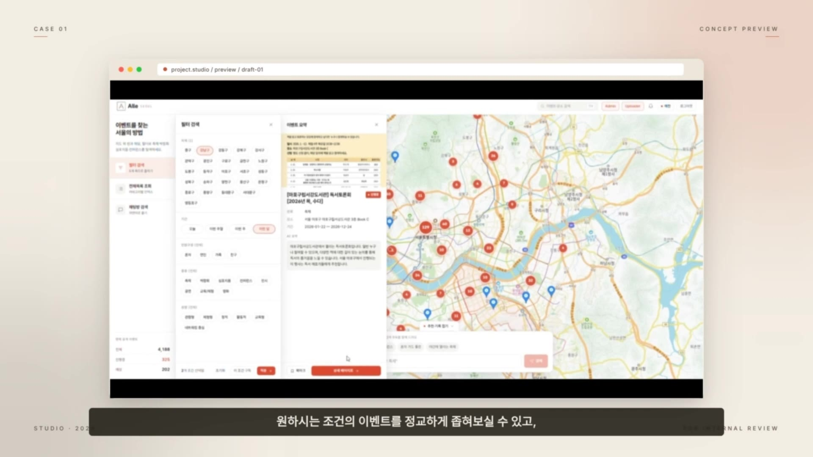
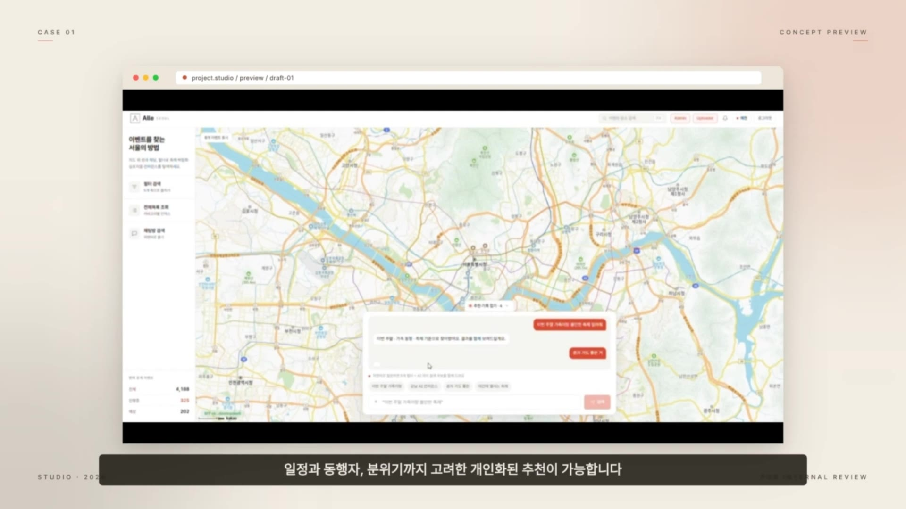
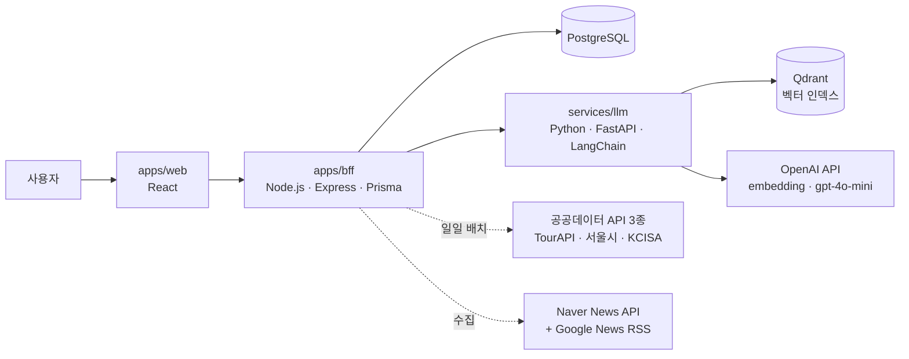

# Alle

> 서울의 축제·박람회·컨퍼런스를 지도 위에서 찾고, 함께 갈 사람까지 연결하는 자연어 기반 이벤트 탐색 서비스.
> 지도 + 필터 5종 + LLM 채팅 검색 + 동행 메이트 매칭.
>
> 레포·패키지·DB 식별자는 `ggdrugs`를 유지합니다 (제품 표기만 Alle로 전환).





## 핵심 기능

- **지도 기반 이벤트 탐색** — 서울시 행정구역 지도 위에서 공공 이벤트를 필터 5종(지역·기간·종류 등)으로 탐색
- **자연어 검색** — "이번 주말 종로 근처 전시 뭐 있어?" 같은 질문을 임베딩 → 벡터 검색 → LLM 응답으로 처리하는 RAG 검색
- **AI 이벤트 요약 + 뉴스 매핑** — 이벤트 상세 설명을 gpt-4o-mini로 2~3문장 요약, Naver News API + Google News RSS 하이브리드로 관련 기사 자동 매핑
- **개인화 추천** — 사용자 북마크·리뷰 시그널 기반 Qdrant personalized kNN 추천 (SQL fallback 포함)
- **리뷰 감성 분석** — LLM 기반 positive/negative/neutral 분류, 규칙 기반 fallback
- **동행 메이트 매칭** — 성별·연령대·지역·국적 등 구조적 속성 기반의 설명 가능한 양방향 점수 매칭

## 아키텍처



## 데이터 · RAG 파이프라인

1. **수집** — 공공데이터 API 3종(TourAPI, 서울시 공공데이터, KCISA)을 24시간 주기 배치로 자동 수집 (`apps/bff/src/jobs/*-ingest.ts`), `(crawl_origin, external_source_id)` 복합 유니크 키 + Prisma upsert로 중복 제거
2. **인덱싱** — 이벤트 텍스트를 OpenAI `text-embedding-3-small`로 임베딩해 Qdrant에 벡터 인덱싱
3. **검색** — 자연어 질의를 동일 임베딩 공간에서 kNN 검색 후 LLM 응답에 연결
4. **보강** — `gpt-4o-mini` 요약 자동 생성(캐시 무효화 관리), 뉴스 관련도 매핑, 리뷰 감성 분석
5. **추천·매칭** — 사용자 시그널 기반 개인화 kNN 추천, 구조적 속성 기반 양방향 스코어 메이트 매칭

## 기술 스택

| 영역 | 스택 |
|---|---|
| Frontend | React, TypeScript |
| BFF | Node.js, Express, Prisma |
| LLM 서비스 | Python, FastAPI, LangChain |
| 데이터 | PostgreSQL, Qdrant, Redis |
| 인프라 | Docker Compose, pnpm 모노레포 |

## 디렉터리

- `apps/web` — React 프론트엔드
- `apps/bff` — Node.js + Express + Prisma (API·배치 잡)
- `services/llm` — Python FastAPI + LangChain (임베딩·RAG·요약)
- `packages/shared-types`, `packages/config` — 공유 타입·설정
- `infra/` — Docker, DB 마이그레이션·초기화
- `docs/` — 요구사항·아키텍처 결정 문서
- `llm_wiki/` — LLM 유지 위키 (Karpathy 패턴)

## 로컬 실행

```bash
docker compose up -d postgres qdrant redis
```

`.env.example`을 참고해 환경 변수를 설정합니다.

## 문서

설계 결정과 요구사항을 문서로 남기며 개발했습니다.

- [docs/decisions/](docs/decisions) — 아키텍처 결정 기록 (ADR)
- [llm_wiki/wiki/index.md](llm_wiki/wiki/index.md) — 요구사항·DB 설계 요약 + 용어집
- [CLAUDE.md](CLAUDE.md) — AI 에이전트 작업 지시서 (컨벤션·금지사항·역할 분담)
- 기획서·요구사항정의서(6차 개정)·DB 요구사항분석서·테이블 명세서·빅데이터 분석 정의서 등 전체 산출문서는 동아 MX School 실전 프로젝트 최종 제출본으로 별도 관리

## 팀 · 역할

동아 MX School 실전 프로젝트 (3인 팀).

- **김예찬** — 개발 전체 단독 담당: 아키텍처 설계, 프론트엔드·BFF·LLM 서비스 구현, 데이터 파이프라인, 인프라 구성, 기술 산출문서(DB 요구사항분석서·테이블 명세서·빅데이터 분석 정의서) 작성
- 팀원 2인 — 서비스 기획, UI/UX 디자인, 발표 자료

개발 과정에서 Claude Code 멀티 에이전트 파이프라인을 활용해 설계·구현·검토를 분담시켰으며, 에이전트 운용 규칙은 [CLAUDE.md](CLAUDE.md)에 기록되어 있습니다.
